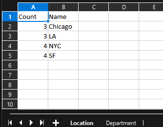
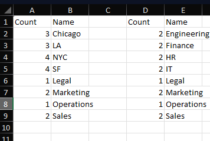
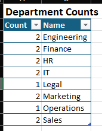
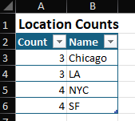

# Powershell ImportExcel
If you have worked with data in powershell you have most likely used the command `export-csv`. This is a great built in command to get the data out of the console and in a file to work with or share. I use `export-csv` a lot on AD queries, building computer reports or just need to view and sort some data quickly. 
<!-- truncate -->
I started using `export-csv` in a lot of my script that where setup with a task scheduler and then send those csv file out as reports. Most of the time these reports would be just for myself. After having one of my report containing M365 license count by site and region was being used by everyone, I had a coworker made a joke about making the report "fancier" since it had made its way up to managers level. I knew about the module `importexcel` but never bothered try working with it. It is a game changer to creating reports. You can create tables, graphs and do a lot by calling teh excel object functions. 

## Getting Started
First thing to do with any powershell module is to install [importexcel](https://github.com/dfinke/ImportExcel)
```powershell
Install-Module -Name ImportExcel
```
if you are going to use this module on an automated script it would be best to install system wide
```powershell
Install-Module -Name ImportExcel -Scope AllUsers
```
A good thing to do with any new module it to see what commands it has that you can use.
```powershell
get-command -module ImportExcel
```
This can will return a list of all `ImportExcel` commands
<div class="scrollable-code">
```powershell showLineNumbers
CommandType     Name                                               Version    Source
-----------     ----                                               -------    ------
Alias           Convert-XlRangeToImage                             7.8.10     importexcel
Alias           Export-ExcelSheet                                  7.8.10     importexcel
Alias           New-ExcelChart                                     7.8.10     importexcel
Alias           Set-Column                                         7.8.10     importexcel
Alias           Set-Format                                         7.8.10     importexcel
Alias           Set-Row                                            7.8.10     importexcel
Alias           Use-ExcelData                                      7.8.10     importexcel
Function        Add-ConditionalFormatting                          7.8.10     importexcel
Function        Add-ExcelChart                                     7.8.10     importexcel
Function        Add-ExcelDataValidationRule                        7.8.10     importexcel
Function        Add-ExcelName                                      7.8.10     importexcel
Function        Add-ExcelTable                                     7.8.10     importexcel
Function        Add-PivotTable                                     7.8.10     importexcel
Function        Add-Worksheet                                      7.8.10     importexcel
Function        BarChart                                           7.8.10     importexcel
Function        Close-ExcelPackage                                 7.8.10     importexcel
Function        ColumnChart                                        7.8.10     importexcel
Function        Compare-Worksheet                                  7.8.10     importexcel
Function        Convert-ExcelRangeToImage                          7.8.10     importexcel
Function        ConvertFrom-ExcelData                              7.8.10     importexcel
Function        ConvertFrom-ExcelSheet                             7.8.10     importexcel
Function        ConvertFrom-ExcelToSQLInsert                       7.8.10     importexcel
Function        ConvertTo-ExcelXlsx                                7.8.10     importexcel
Function        Copy-ExcelWorksheet                                7.8.10     importexcel
Function        DoChart                                            7.8.10     importexcel
Function        Enable-ExcelAutoFilter                             7.8.10     importexcel
Function        Enable-ExcelAutofit                                7.8.10     importexcel
Function        Expand-NumberFormat                                7.8.10     importexcel
Function        Export-Excel                                       7.8.10     importexcel
Function        Get-ExcelColumnName                                7.8.10     importexcel
Function        Get-ExcelFileSchema                                7.8.10     importexcel
Function        Get-ExcelFileSummary                               7.8.10     importexcel
Function        Get-ExcelSheetDimensionAddress                     7.8.10     importexcel
Function        Get-ExcelSheetInfo                                 7.8.10     importexcel
Function        Get-ExcelWorkbookInfo                              7.8.10     importexcel
Function        Get-HtmlTable                                      7.8.10     importexcel
Function        Get-Range                                          7.8.10     importexcel
Function        Get-XYRange                                        7.8.10     importexcel
Function        Import-Excel                                       7.8.10     importexcel
Function        Import-Html                                        7.8.10     importexcel
Function        Import-UPS                                         7.8.10     importexcel
Function        Import-USPS                                        7.8.10     importexcel
Function        Invoke-ExcelQuery                                  7.8.10     importexcel
Function        Invoke-Sum                                         7.8.10     importexcel
Function        Join-Worksheet                                     7.8.10     importexcel
Function        LineChart                                          7.8.10     importexcel
Function        Merge-MultipleSheets                               7.8.10     importexcel
Function        Merge-Worksheet                                    7.8.10     importexcel
Function        New-ConditionalFormattingIconSet                   7.8.10     importexcel
Function        New-ConditionalText                                7.8.10     importexcel
Function        New-ExcelChartDefinition                           7.8.10     importexcel
Function        New-ExcelStyle                                     7.8.10     importexcel
Function        New-PivotTableDefinition                           7.8.10     importexcel
Function        New-Plot                                           7.8.10     importexcel
Function        New-PSItem                                         7.8.10     importexcel
Function        Open-ExcelPackage                                  7.8.10     importexcel
Function        PieChart                                           7.8.10     importexcel
Function        Pivot                                              7.8.10     importexcel
Function        Read-Clipboard                                     7.8.10     importexcel
Function        Read-OleDbData                                     7.8.10     importexcel
Function        ReadClipboardImpl                                  7.8.10     importexcel
Function        Remove-Worksheet                                   7.8.10     importexcel
Function        Select-Worksheet                                   7.8.10     importexcel
Function        Send-SQLDataToExcel                                7.8.10     importexcel
Function        Set-CellComment                                    7.8.10     importexcel
Function        Set-CellStyle                                      7.8.10     importexcel
Function        Set-ExcelColumn                                    7.8.10     importexcel
Function        Set-ExcelRange                                     7.8.10     importexcel
Function        Set-ExcelRow                                       7.8.10     importexcel
Function        Set-WorksheetProtection                            7.8.10     importexcel
Function        Test-Boolean                                       7.8.10     importexcel
Function        Test-Date                                          7.8.10     importexcel
Function        Test-Integer                                       7.8.10     importexcel
Function        Test-Number                                        7.8.10     importexcel
Function        Test-String                                        7.8.10     importexcel
Function        Update-FirstObjectProperties                       7.8.10     importexcel
```
</div><br/><br/>

We wont be going though all these command on this article. The first one we will talk about is `export-excel`

## Import-Excel

 `Import-excel` lets you quickly read an excel spreadsheet into a PowerShell array
```powershell
$data = Import-Excel .\salesData.xlsx

$data

Region State        Units Price
------ -----        ----- -----
West   Texas        927   923.71
North  Tennessee    466   770.67
East   Florida      520   458.68
East   Maine        828   661.24
West   Virginia     465   053.58
North  Missouri     436   235.67
South  Kansas       214   992.47
North  North Dakota 789   640.72
South  Delaware     712   508.55
```
## Export-Excel
let say you are trying to build a report of users grouped by department, and region. 

Giving this sample data:

<div class="scrollable-code">
| Username     | First Name | Last Name  | Email                    | Phone Number  | Department   | Title               | Office        | Manager       | Location |
|--------------|------------|------------|--------------------------|---------------|--------------|---------------------|---------------|---------------|----------|
| jdoe         | John       | Doe        | jdoe@example.com          | +1-555-1234   | Sales       | Sales Manager       | New York      | Sarah Smith   | NYC      |
| asmith       | Alice      | Smith      | asmith@example.com        | +1-555-2345   | HR          | HR Specialist       | Chicago       | John Doe      | Chicago |
| bclark       | Bob        | Clark      | bclark@example.com        | +1-555-3456   | IT          | System Administrator| San Francisco | Alice Smith   | SF       |
| mwhite       | Mary       | White      | mwhite@example.com        | +1-555-4567   | Marketing   | Marketing Director  | Los Angeles   | John Doe      | LA       |
| tjones       | Tom        | Jones      | tjones@example.com        | +1-555-5678   | Sales       | Account Executive   | New York      | John Doe      | NYC      |
| ckim         | Christine  | Kim        | ckim@example.com          | +1-555-6789   | Finance     | Financial Analyst   | Chicago       | Sarah Smith   | Chicago |
| dlee         | David      | Lee        | dlee@example.com          | +1-555-7890   | Engineering | Software Engineer   | San Francisco | Bob Clark     | SF       |
| ejohnson     | Emily      | Johnson    | ejohnson@example.com      | +1-555-8901   | Legal       | Legal Counsel       | San Francisco | Alice Smith   | SF       |
| mjones       | Michael    | Jones      | mjones@example.com        | +1-555-9012   | Operations  | Operations Manager  | New York      | John Doe      | NYC      |
| psmith       | Paul       | Smith      | psmith@example.com        | +1-555-0123   | HR          | HR Manager          | Los Angeles   | Tom Jones     | LA       |
| swhite       | Sarah      | White      | swhite@example.com        | +1-555-1234   | IT          | Network Administrator| Chicago      | Bob Clark     | Chicago |
| ljames       | Laura      | James      | ljames@example.com        | +1-555-2345   | Marketing   | Marketing Specialist| San Francisco | Mary White    | SF       |
| tkim         | Tina       | Kim        | tkim@example.com          | +1-555-3456   | Finance     | Accountant          | Los Angeles   | Sarah White   | LA       |
| bthompson    | Bill       | Thompson   | bthompson@example.com     | +1-555-4567   | Engineering | DevOps Engineer     | New York      | David Lee     | NYC      |

</div><br/>

You can build two simple tables grouping department and location by:
```powershell
$user = get-aduser -filter * -properties * | select-object Name, Department, Office, State

$departments = $user | Group-Object -Property Department | Select-Object count, Name
$location = $user | Group-Object -Property Location | Select-Object count, Name


#This will give two table
$departments

Count Name
----- ----
    2 Engineering
    2 Finance
    2 HR
    2 IT
    1 Legal
    2 Marketing
    1 Operations
    2 Sales

$location

Count Name
----- ----
    3 Chicago
    3 LA
    4 NYC
    4 SF
```
With export-excel you can easily export these two a single excel sheet as tables or have them on different sheets. 
### Different Sheets
```powershell title="Different Sheets"
$location | export-excel -Path c:\%PATH%\report.xlsx -WorksheetName "Location"

$Department | export-excel -Path c:\%PATH%\report.xlsx -WorksheetName "Department"
```

You can see there is a sheet name Location and Department with the respective table



### Same Sheet

For a simple data table like these they can listed on the same sheets without any issues. By default export-excel will start putting the data in cell`A1`. It you try to export multiple variables to a excel workbook it will just over write the existing data. To get around this you select the start row and column. 

```powershell
$location | export-excel -Path c:\temp\report.xlsx -WorksheetName "Location"  -StartRow 1 -StartColumn 1

$Department | export-excel -Path c:\temp\report.xlsx -WorksheetName "Department" -StartRow 1 -StartColumn 4
```

Adding the options `-StartRow` and `-StartColumn` will let you set the start cell the data is exported to. The only difference is the column is a number instead of A,B,C..  So Cell `D1` would be `-StartRow 1 -StartColumn 4`


### Making it Fancier
One of the benefits of using ImportExcel is the ability to make tables look fancier. Right now this look the same as just export-csv expect it is on different sheets. Let make it look a little nicer. 
```powershell title="Formatting the tables"
$location | export-excel -Path c:\temp\report.xlsx -WorksheetName "Location" -TableName "Locations" -TableStyle light9 -Title "Location Counts" -TitleBold -TitleSize 14 -AutoSize

$Department | export-excel -Path c:\temp\report.xlsx -WorksheetName "Department" -TableName "Department" -TableStyle light9 -Title "Department Counts" -TitleBold -TitleSize 14 -AutoSize
```
Now when we look at the excel table it is has a header with "Locations Counts"/"Department Counts" and you can select the table from the name box. It will also have the table sytle light9 from excel. 



Each option:
- `WorksheetName`: The name of the sheet. By default it will be sheet1
- `TableStyle`: This lets you select one of excel predefined table styles
- `TableName`: The name of the table in within the excel workbook
- `Title`: A table title displayed above the table headers
- `TitleBold`: Sets the table title bold
- `TitleSize`: The font size of the title
- `Autosize`: Will set the width of the column to the content size


## Wrapping up
These two commands, `import-excel` and `export-excel` will be a good start with `importexcel` module. There are a lot of other commands that let you do additional function. Add pivot tables, graphs, conditional formatting, in future posts we can review the use of those. 