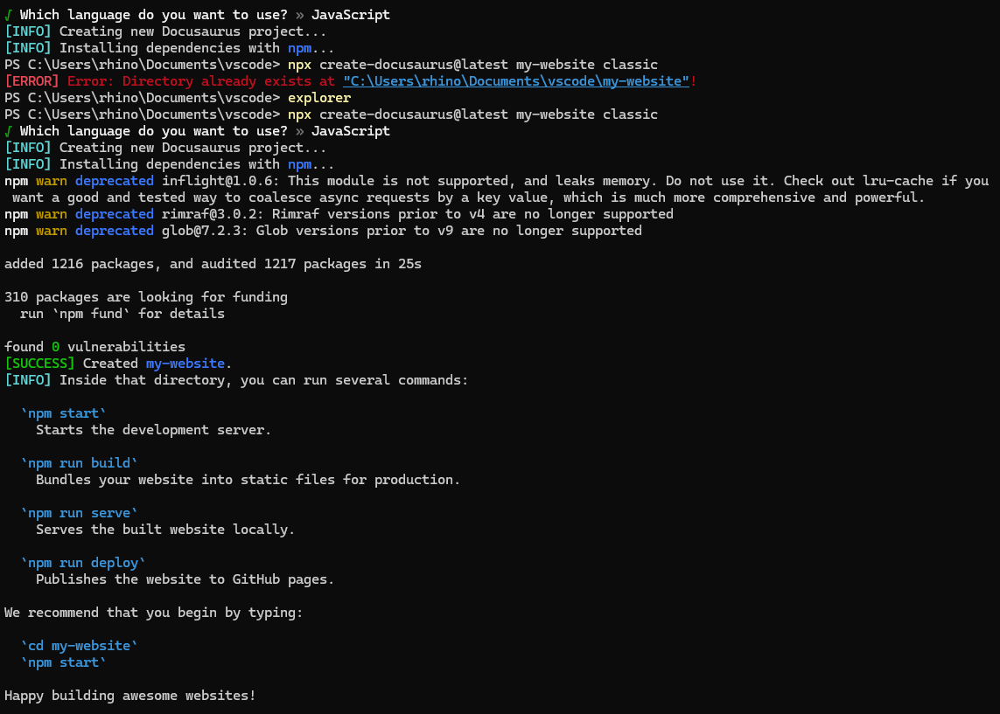
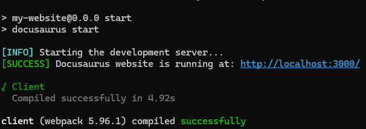
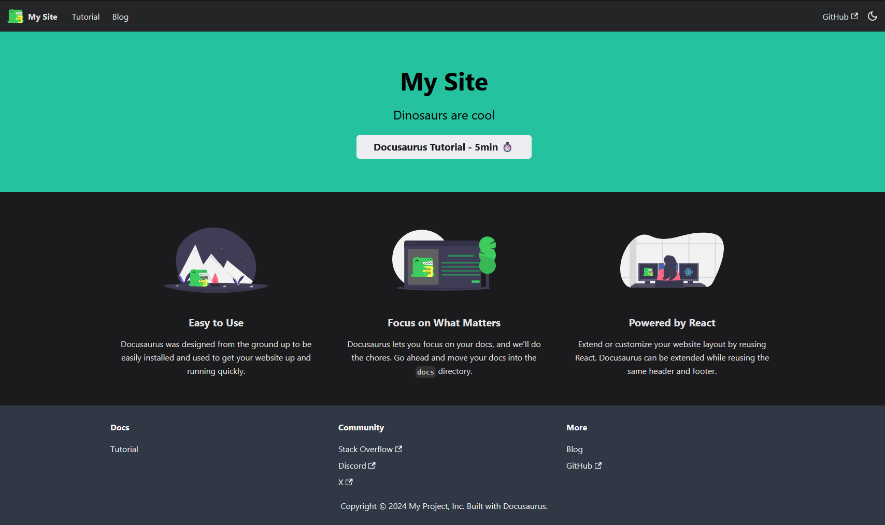

# Setting Up Docusaurs
The process of learing of Docusaurus and the base setup of Wondering Admin. 

<!--intro-->

The Docusaurus [getting status](https://docusaurus.io/docs/installation) documentation is a great tool to follow and use. To be able to run and test the site locally you need node.js V18+. To install node.js you can use the isntaller found at [node.js](https://nodejs.org/en/download/package-manager), I used [chocolatey](https://chocolatey.org/install) to installed it. 

## Chocolatey & Node.js
[Chocolatey](https://chocolatey.org/) is a great tool to install program via the command lind. Windows has created their own version of it, while its works pretty good and is great for some programs I have found Chocolatey works better for devlopment tools.

To get started with Chocolatey you can install it with the [downloader here](https://chocolatey.org/install#generic). 

The other option is to use winget to install chocolatey 
```
winget install Chocolatey.Chocolatey
```
That will install Chocolatey, once it is install you can use chocolatey to install node.js with the following command. 
```
choco install node.js
```

## Docusaurus Setup

Now that Node.js is install we can get Docusaurus installed and running locally. 

### Docusaurus install

You can get the basic setup by running the command 
``` bash
#Change my-website to what you called your repo/site 
npx create-docusaurus@latest my-website classic
```
This will run though the download script. It does prompt you to select between JavaScript & TypeScript
``` 
? Which language do you want to use? » - Use arrow-keys. Return to submit.
>   JavaScript
    TypeScript
```
 
 I know a little JavaScript and even less with TypeScript, I selected JavaScript. It will take a minute or so and download the required files. 



 All the basic files are now available inside the folder called `my-website` or whatever you named it.  We can view the site now with all its defaults. To do you will want to run the follow commands inside your site root folder:
``` bash
#change my-website to what you called the folder
cd ./my-website

#run to start the website
npm start

#To stop the website from running press ctrl+c
```


It will launch in your default browser and continue to run until you `ctrl+c` in the terminal. 




### Configuring Docusaurus

In `docusaurus.config.js` you will want to change some variables. You will want to fine this section to change the variables. The comments are helpful, the whole documentation is really good. This section is line 13-26 in `docusaurus.config.js`. 
```js
  title: 'My Site',
  tagline: 'Dinosaurs are cool',
  favicon: 'img/favicon.ico',

  // Set the production url of your site here
  url: 'https://your-docusaurus-site.example.com',
  // Set the /<baseUrl>/ pathname under which your site is served
  // For GitHub pages deployment, it is often '/<projectName>/'
  baseUrl: '/',

  // GitHub pages deployment config.
  // If you aren't using GitHub pages, you don't need these.
  organizationName: 'facebook', // Usually your GitHub org/user name.
  projectName: 'docusaurus', // Usually your repo name.
```

The default homepage top section will use these variable when building. 
```js
  title: 'My Site', //Change to the name of your website. This is also used in title tab
  tagline: 'Dinosaurs are cool', //Can be anything you would like. 
```

If you are hosting this on github pages without a custom domain you will want to add `trailingSlash: false,` on the line after Project name it should look like: 
```js
  organizationName: 'facebook', // Usually your GitHub org/user name.
  projectName: 'docusaurus', // Usually your repo name.
  trailingSlash: false,
```

## Docusaurus Additional Setup

### homepage
If you are familiar with JS and React these next steps will be straight forward. 

The homepage is built with two `.js` files. The one that build the homepage is: `/pages/index.js`. In this file has a function call that build middle section, that function is defined `/src/components/HomepageFeatures/index.js`

If you are keeping the same layout style provided by default, there is not much you need to change in `/pages/index.js`. The one thing I would point out to change is the tab title. 

The tab title will change depending on the page. By default it will show these:
| homepage | Hello From My Site \| My Site|
|---|---|
|Blog | Blog \| My Site 
| Docs | Doc \| My Site

If you want to change this for the homepage, you can find the below in `/pages/index.js`
```js
title={`Hello from ${siteConfig.title}`}
```
change it to whatever you would like. 


The second file, `/src/components/HomepageFeatures/index.js`, has more of the actual information that is used and displayed. 

In the file you will find blocks:
```js
{
    title: 'Easy to Use',
    Svg: require('@site/static/img/Automate.svg').default,
    description: (
      <>
        Docusaurus was designed form the ground up to be easily installed and used to get your website up and running quickly. 
      </>
    ),
  },
  ```
  There is 3 block by default and they equally spaced, and centered on the page. Change the title, svg, and descriptions to change them. 

### Color theme
The only thing left is changing the color scheme. This will affect the whole website color scheme. The file `/src/css/custom.css` holds all the color hex values for dark and light mode. Adjust them as you want. 

By default it will select light mode for new user, personally the first thing I do it change everything to dark mode. Because of these I added this code to set the default theme to dark mode. 
```js
//add to docusaurus.config.js after the prism block
colorMode: {
        defaultMode: 'dark',
        disableSwitch: false,
      },
```


## Github
Once you have your site looking the way you want locally, we can upload and do the first commit to github or any other git platform. These steps will mainly focus on github but should transfer to other git plateforms. 
